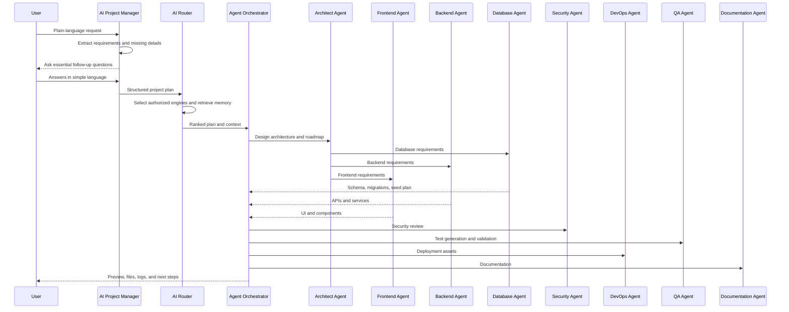

# AI Orchestration and Agent Workflows

## Multi-AI Architecture

Jarvis Builder uses an AI Router and Agent Orchestrator to transform user requests into validated software artifacts. The platform supports multiple AI engines when the customer has authorized the provider and configured required credentials.

## AI Engines

| Engine Type | Use Cases |
| --- | --- |
| OpenAI-compatible generation engine | Requirements analysis, code generation, structured plans, tests, documentation, reasoning-heavy tasks |
| Claude-compatible agent | Long-context review, architecture critique, documentation refinement, UX copy, code review, safety review |
| Specialized code model | Language-specific implementation, refactoring, test generation, static analysis assistance |
| Local/private model | Enterprise privacy-sensitive tasks, offline classification, low-latency autocomplete |
| Embedding model | Semantic project memory, retrieval, code search, similarity ranking |
| Deterministic rules engine | Policy enforcement, schema validation, cost limits, security checks, output format validation |

## Task-Based Model Selection

The AI Router scores each task with:

- Task type: planning, architecture, frontend, backend, database, API, DevOps, security, QA, documentation, UX.
- Required languages and frameworks.
- Context length and retrieval needs.
- Latency target and budget cap.
- Safety sensitivity and customer policy.
- Provider availability and historical quality.
- Need for parallel model comparison.

## Routing Algorithm

```text
1. Normalize prompt and classify intent.
2. Retrieve project memory, code context, templates, and policy constraints.
3. Choose candidate engines based on task, language, budget, and provider authorization.
4. Run one or more engines in parallel for high-value or ambiguous work.
5. Validate each result for schema, security, correctness, and policy compliance.
6. Rank outputs by quality, consistency, testability, cost, and risk.
7. Merge compatible results into a single patch or artifact set.
8. Send merged output to specialized agents for implementation or review.
9. Store durable memories, rationale, cost, and validation results.
```

## Agent System

| Agent | Responsibility |
| --- | --- |
| Architect Agent | Requirements decomposition, stack selection, system design, roadmap, folder structure, integration map |
| Frontend Agent | UI generation, design system, responsive pages, component generation, accessibility, SEO, animations |
| Backend Agent | Services, APIs, business logic, workers, integrations, validation, logging |
| Database Agent | ER diagrams, schemas, migrations, seed files, indexes, data access policies |
| Security Agent | Threat modeling, auth, authorization, input validation, encryption, audit, abuse prevention |
| DevOps Agent | Docker, Kubernetes, Terraform, CI/CD, observability, environments, rollback plans |
| QA Agent | Unit, integration, e2e, load, accessibility, security, and regression tests |
| Documentation Agent | Product docs, technical docs, API docs, deployment docs, user guides |
| Claude AI Agent | Optional authorized long-context assistant for deep review, alternate implementation suggestions, requirement clarification, UX wording, and safety critique |

## Agent Workflow Diagram



## Context Memory System

### Short-Term Context

- Current prompt and chat history.
- Open files, current diffs, active roadmap, latest build logs.
- Temporary agent scratchpad with automatic expiration.

### Long-Term Project Memory

- Product goals, target users, chosen stack, brand preferences, compliance requirements, deployment preferences, database decisions, API conventions, generated file facts, and known risks.
- Memory entries include confidence, source, retention policy, and tenant access scope.
- Sensitive memories are encrypted and excluded from unauthorized providers.

## Result Ranking and Merging

Results are ranked by:

- Requirement coverage.
- Code correctness and compile readiness.
- Security posture.
- Accessibility and UX quality.
- Maintainability and documentation quality.
- Test coverage and deployment readiness.
- Cost efficiency and latency.

Merging uses structured AST-aware patch generation where possible. If outputs conflict, the orchestrator asks a review agent to select or synthesize the best option and records the rationale.

## Follow-Up Question Strategy

The system should ask the fewest questions needed to avoid building the wrong product. Questions should be simple and actionable:

- "App web ke liye chahiye, mobile ke liye, ya dono?"
- "Payment lena hai? Agar haan, kaunsa provider use karna hai?"
- "Login users ke liye chahiye ya sirf admin ke liye?"
- "Design simple, modern, luxury, ya colorful chahiye?"

## Safety and Permission Controls

- AI providers are used only when authorized by the tenant policy.
- Generated code must not include stolen proprietary code, malware, credential theft, illegal bypasses, or unauthorized access flows.
- User data is minimized before provider calls and redacted when policy requires it.
- The Security Agent reviews high-risk requests before execution.
