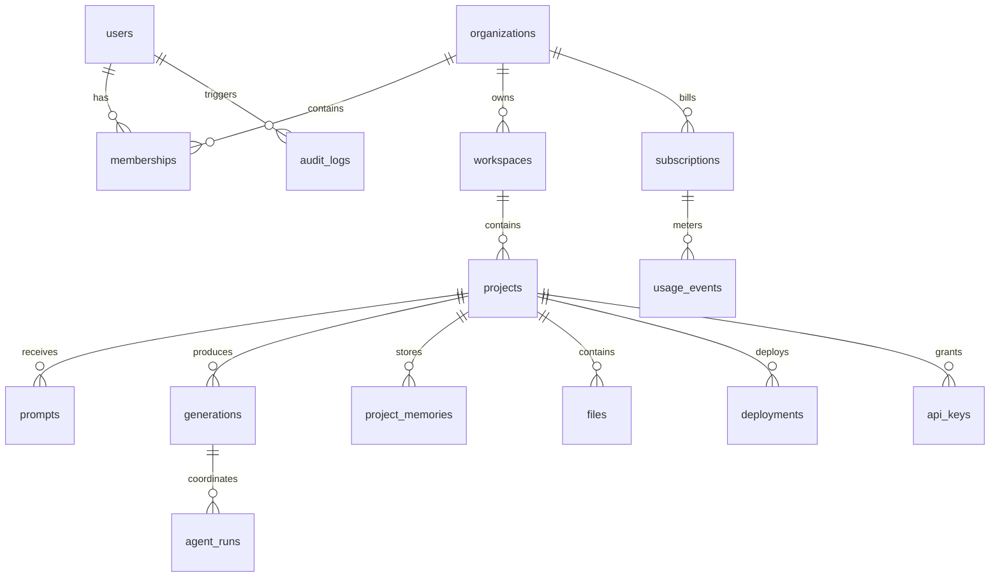

# Database Schema

## Storage Strategy

Jarvis Builder uses PostgreSQL as the primary system-of-record database, Redis for caching and queues, object storage for generated files and build artifacts, and a vector database for semantic memory. MongoDB, MySQL, and SQLite are supported as generated target databases for customer projects.

## Entity Relationship Overview

## PostgreSQL Tables

### users

| Column | Type | Notes |
| --- | --- | --- |
| id | uuid PK | User identifier |
| email | citext unique nullable | Required for registered users |
| display_name | text | Public display name |
| avatar_url | text nullable | Profile image |
| auth_provider | text | email, oauth, sso, guest |
| password_hash | text nullable | Argon2id hash for email login |
| mfa_enabled | boolean | Multi-factor status |
| status | text | active, suspended, deleted |
| created_at | timestamptz | Creation time |
| updated_at | timestamptz | Last update time |

### organizations

| Column | Type | Notes |
| --- | --- | --- |
| id | uuid PK | Organization identifier |
| name | text | Organization name |
| slug | text unique | URL-safe name |
| plan | text | free, pro, team, enterprise |
| data_region | text | Data residency region |
| default_policy_id | uuid nullable | Model and security policy |
| created_at | timestamptz | Creation time |

### memberships

| Column | Type | Notes |
| --- | --- | --- |
| id | uuid PK | Membership identifier |
| user_id | uuid FK users.id | User |
| organization_id | uuid FK organizations.id | Organization |
| role | text | owner, admin, builder, reviewer, billing, viewer |
| status | text | invited, active, removed |
| created_at | timestamptz | Creation time |

### workspaces

| Column | Type | Notes |
| --- | --- | --- |
| id | uuid PK | Workspace identifier |
| organization_id | uuid FK organizations.id | Tenant owner |
| name | text | Workspace name |
| visibility | text | private, team, shared |
| settings | jsonb | Workspace preferences |
| created_at | timestamptz | Creation time |

### projects

| Column | Type | Notes |
| --- | --- | --- |
| id | uuid PK | Project identifier |
| workspace_id | uuid FK workspaces.id | Workspace |
| owner_id | uuid FK users.id | Owner |
| name | text | Project name |
| type | text | website, web_app, mobile_app, api, database, saas, automation |
| status | text | planning, generating, reviewing, deployed, archived |
| stack | jsonb | Selected languages, frameworks, database, deployment target |
| requirements | jsonb | Structured requirements |
| roadmap | jsonb | Milestones and acceptance criteria |
| created_at | timestamptz | Creation time |
| updated_at | timestamptz | Last update time |

### prompts

| Column | Type | Notes |
| --- | --- | --- |
| id | uuid PK | Prompt identifier |
| project_id | uuid FK projects.id | Project |
| user_id | uuid FK users.id | Author |
| language | text | Detected language |
| raw_text | text | Original prompt |
| normalized_intent | jsonb | Extracted intent |
| safety_classification | jsonb | Safety and compliance metadata |
| created_at | timestamptz | Creation time |

### generations

| Column | Type | Notes |
| --- | --- | --- |
| id | uuid PK | Generation identifier |
| project_id | uuid FK projects.id | Project |
| prompt_id | uuid FK prompts.id | Source prompt |
| status | text | queued, running, succeeded, failed, canceled |
| task_type | text | architecture, frontend, backend, database, api, test, deploy, docs |
| selected_models | jsonb | Models used and routing rationale |
| ranking_score | numeric | Final quality score |
| cost_cents | integer | Estimated cost |
| started_at | timestamptz nullable | Start time |
| completed_at | timestamptz nullable | Completion time |

### agent_runs

| Column | Type | Notes |
| --- | --- | --- |
| id | uuid PK | Agent run identifier |
| generation_id | uuid FK generations.id | Generation |
| agent_type | text | architect, frontend, backend, database, security, devops, qa, documentation, claude_assistant |
| input_context | jsonb | Scoped context |
| output_summary | text | Human-readable result |
| patch_refs | jsonb | File patches or artifact references |
| validation_results | jsonb | Lint, test, scan, review outputs |
| status | text | queued, running, succeeded, failed |
| created_at | timestamptz | Creation time |

### files

| Column | Type | Notes |
| --- | --- | --- |
| id | uuid PK | File identifier |
| project_id | uuid FK projects.id | Project |
| path | text | Repository-relative path |
| content_hash | text | Integrity hash |
| storage_uri | text | Object storage location |
| language | text nullable | Detected language |
| version | integer | File version |
| created_by_generation_id | uuid nullable | Producing generation |
| updated_at | timestamptz | Last update time |

### project_memories

| Column | Type | Notes |
| --- | --- | --- |
| id | uuid PK | Memory identifier |
| project_id | uuid FK projects.id | Project |
| memory_type | text | requirement, decision, preference, code_fact, risk, deployment_fact |
| summary | text | Compact memory |
| embedding_ref | text nullable | Vector index reference |
| confidence | numeric | Confidence score |
| expires_at | timestamptz nullable | Retention boundary |
| created_at | timestamptz | Creation time |

### deployments

| Column | Type | Notes |
| --- | --- | --- |
| id | uuid PK | Deployment identifier |
| project_id | uuid FK projects.id | Project |
| environment | text | preview, staging, production |
| provider | text | docker, kubernetes, cloud, custom |
| status | text | queued, building, deploying, healthy, failed, rolled_back |
| artifact_uri | text | Signed artifact path |
| public_url | text nullable | Live URL |
| health_status | jsonb | Health checks |
| created_at | timestamptz | Creation time |

### subscriptions and usage_events

| Table | Purpose |
| --- | --- |
| subscriptions | Stores plan, billing provider customer ID, seat limits, quota policy, renewal status, and invoice metadata. |
| usage_events | Stores token usage, model calls, build minutes, storage, deployments, premium templates, and credit adjustments. |

### audit_logs

| Column | Type | Notes |
| --- | --- | --- |
| id | uuid PK | Audit event identifier |
| organization_id | uuid FK organizations.id | Tenant |
| actor_user_id | uuid nullable | User or system actor |
| action | text | Event name |
| resource_type | text | Target type |
| resource_id | uuid nullable | Target ID |
| ip_address | inet nullable | Source IP |
| user_agent | text nullable | Client |
| metadata | jsonb | Structured details |
| created_at | timestamptz | Event time |

## Indexing and Partitioning

- Partition prompts, generations, agent_runs, usage_events, and audit_logs by month for high-volume tenants.
- Add composite indexes on organization_id, workspace_id, project_id, status, and created_at.
- Use row-level security for enterprise tenants that require strict data isolation.
- Keep embeddings in tenant-scoped vector indexes and store only references in PostgreSQL.

## Generated Customer Database Support

The Database Agent can emit schemas for PostgreSQL, MySQL, MongoDB, and SQLite. It should generate ER diagrams, migrations, seed files, indexes, validation rules, and rollback plans. For regulated applications, it should also generate retention policies, audit fields, and access-control recommendations.
