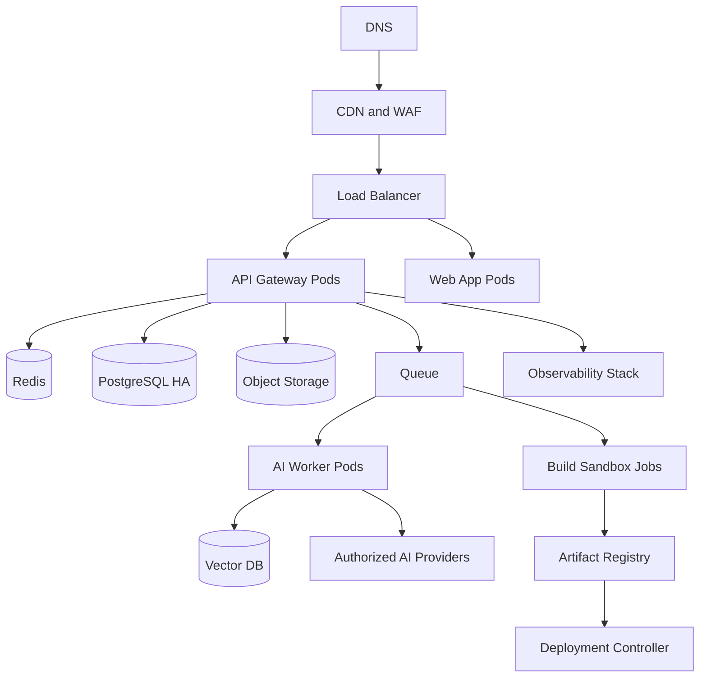
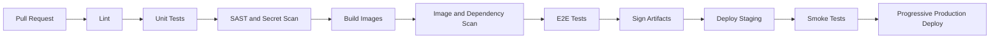

# DevOps Architecture and Deployment Strategy

## Deployment Goals

- Support local development, preview, staging, and production environments.
- Generate Docker, Kubernetes, Terraform, and CI/CD assets for customer projects.
- Provide safe previews and production deployments with rollback.
- Scale API, workers, build sandboxes, and AI workloads independently.

## Reference Infrastructure

## Docker Strategy

- Separate images for web, admin, API, worker, and build sandbox.
- Multi-stage builds with minimal runtime images.
- Non-root containers and read-only filesystems where practical.
- SBOM generation, vulnerability scanning, and signed images.
- Docker Compose for local development with PostgreSQL, Redis, object-storage emulator, and mock AI provider.

## Kubernetes Strategy

- Helm chart per service plus shared platform chart.
- Horizontal Pod Autoscaler for web, API, workers, and preview services.
- KEDA-based scaling for queue-backed workers.
- Network policies for service isolation.
- Pod security standards, resource limits, liveness probes, readiness probes, and startup probes.
- Separate namespaces for production, staging, preview, and build sandboxes.

## CI/CD Pipeline

## Generated Deployment Assets

Jarvis Builder can generate for customer projects:

- `Dockerfile`, `.dockerignore`, and `docker-compose.yml`.
- Kubernetes manifests, Helm charts, services, ingress, secrets templates, config maps, autoscaling, and probes.
- Terraform modules for cloud databases, storage, compute, networking, DNS, and secrets.
- CI/CD pipelines for GitHub Actions, GitLab CI, Azure DevOps, or other approved systems.
- Observability configs for logs, metrics, traces, alerts, and dashboards.

## Environment Strategy

| Environment | Purpose | Controls |
| --- | --- | --- |
| Local | Developer iteration | Mock providers, local database, no production secrets |
| Preview | Per-project AI-generated preview | Ephemeral runtime, strict quotas, temporary URL |
| Staging | Release validation | Production-like data shape, sanitized data, full scans |
| Production | Customer-facing runtime | HA, backups, monitoring, rollback, audit logging |

## Observability

- Distributed tracing across API, AI router, workers, build sandbox, and deployment controller.
- Metrics for latency, errors, queue depth, token cost, provider health, build duration, deployment health, and billing usage.
- Structured logs with correlation IDs and tenant-safe metadata.
- SLO dashboards, alert routing, incident timelines, and post-incident review templates.

## Backup and Disaster Recovery

- PostgreSQL point-in-time recovery with cross-region replicas for enterprise tiers.
- Object storage versioning and lifecycle policies.
- Encrypted backups with regular restore drills.
- Runbooks for provider outage, region failover, queue overload, billing webhook failure, and compromised key rotation.

## Deployment Flow for Generated Projects

1. User selects preview, staging, or production deployment.
2. DevOps Agent generates deployment assets and environment requirements.
3. Security Agent validates secrets, network exposure, and auth settings.
4. Build sandbox creates signed artifact.
5. QA Agent runs tests and smoke checks.
6. Deployment controller deploys progressively.
7. Health checks verify readiness.
8. Rollback is available from the last known-good artifact.
