# Frontend Design System and Dashboards

## Experience Principles

- The primary interface must feel like a simple conversation, not a technical form.
- Every complex AI action should show progress, explain what is happening, and offer undo.
- Non-technical users should be able to say simple commands like "make it mobile friendly" or "add login".
- Technical users should be able to inspect files, diffs, APIs, logs, database schemas, and deployment settings.
- Accessibility, responsive behavior, SEO, and performance are default requirements.

## Design Tokens

| Token Group | Examples |
| --- | --- |
| Color | `brand.50` through `brand.950`, semantic `success`, `warning`, `danger`, `info`, `surface`, `border`, `text` |
| Typography | `font.sans`, `font.mono`, sizes from `xs` to `7xl`, line heights, letter spacing |
| Spacing | 4px base scale, layout gaps, container widths, panel padding |
| Radius | `sm`, `md`, `lg`, `xl`, `2xl`, `full` |
| Shadow | `card`, `popover`, `modal`, `focus`, `glow` |
| Motion | 120ms micro, 220ms standard, 420ms emphasized, reduced-motion fallback |

## Core Components

- App shell, top navigation, sidebar, breadcrumbs, command palette.
- Prompt composer with attachments, examples, language detection, and simple-language mode.
- Requirement cards, follow-up question cards, roadmap timeline, milestone board.
- AI agent activity feed with status, confidence, model, cost, and validation badges.
- File explorer, Monaco-style editor, diff viewer, preview iframe, terminal simulation, build logs.
- Drag-and-drop canvas, component palette, style inspector, responsive breakpoint controls.
- Theme generator, typography picker, color palette generator, animation builder.
- Billing cards, usage charts, invoices, team-seat manager, enterprise policy editor.

## Website Builder

```mermaid
flowchart LR
  Prompt[User prompt] --> PageAI[AI page generation]
  PageAI --> Canvas[Drag-and-drop canvas]
  Canvas --> Components[AI component generator]
  Components --> Theme[Theme generator]
  Theme --> SEO[SEO optimizer]
  SEO --> A11Y[Accessibility checker]
  A11Y --> Preview[Responsive preview]
  Preview --> Export[Export / deploy]
```

### Features

- AI page generation for landing pages, portfolios, stores, blogs, dashboards, documentation, and marketing sites.
- Drag-and-drop sections, reusable components, responsive grid editing, and breakpoint previews.
- SEO metadata suggestions, structured data, sitemap generation, image alt text, and performance recommendations.
- Accessibility support with contrast checks, keyboard navigation checks, ARIA recommendations, and screen-reader preview notes.
- Animation builder with safe presets, scroll animations, hover states, and reduced-motion fallbacks.

## Application Builder UX

Application generation follows a guided workflow:

1. Idea intake in simple language.
2. AI-generated product brief with target users, features, risks, and missing details.
3. Stack recommendation with explainable tradeoffs.
4. Generated sitemap, user journeys, database model, API plan, and security model.
5. Live workspace with generated files, preview, test logs, and deployment readiness.
6. Iterative natural-language edits.

## User Dashboard

The user dashboard includes:

- Project cards with status, stack, last generation, deployment status, and cost summary.
- Create flow for website, web app, mobile app, API, database, SaaS, CRM, ERP, e-commerce, dashboard, and automation system.
- Recent prompts, active AI jobs, build logs, deployment health, and team activity.
- Usage and billing summary with quota alerts.
- Memory and preferences panel for brand, tech stack, compliance, and deployment defaults.

## Admin Dashboard

The admin dashboard includes:

- Tenant usage, revenue, subscriptions, trials, churn risk, quota violations, and billing webhook status.
- AI provider health, latency, cost, error rates, model success rates, and quality scores.
- Security alerts, audit logs, abuse reports, blocked requests, high-risk generation attempts, and suspicious sessions.
- Worker fleet metrics, queue depth, build failures, deployment failures, and storage growth.
- Feature flags, template management, model routing policies, pricing rules, and enterprise controls.

## Accessibility Requirements

- WCAG 2.2 AA target.
- Keyboard-accessible navigation and canvas controls.
- Semantic headings, landmarks, labels, and focus management.
- High-contrast and reduced-motion modes.
- Screen-reader-friendly progress states and generation summaries.
