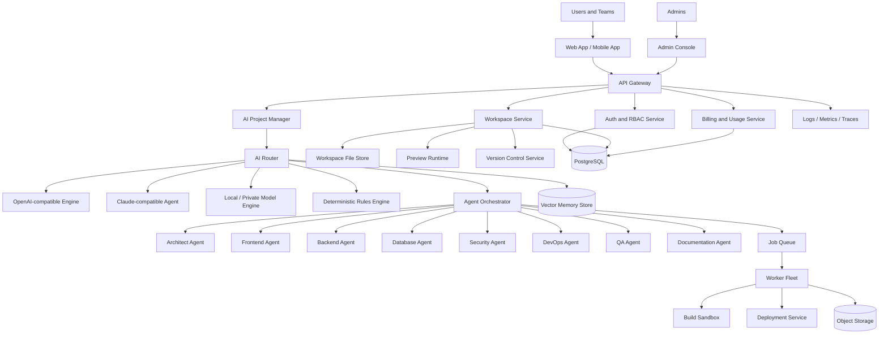

# Jarvis Builder System Architecture

## Architecture Goals

Jarvis Builder is a cloud-native, multi-tenant AI software factory. Its architecture is optimized for:

- Natural-language product creation for non-technical users.
- Enterprise-grade security, billing, observability, and governance.
- Multi-model AI routing with parallel execution, ranking, and result merging.
- Full-stack artifact generation across web, mobile, backend, database, API, documentation, tests, and deployment assets.
- Horizontal scaling for millions of users and high-volume AI jobs.

## High-Level Platform Diagram

## Core Services

### API Gateway

- Terminates HTTPS and validates request signatures.
- Routes REST, GraphQL, and WebSocket traffic.
- Applies rate limits, tenant limits, WAF rules, and request-size controls.
- Emits audit events for sensitive operations.

### Auth and RBAC Service

- Supports guest sessions, email/password, magic links, OAuth, enterprise SSO, session rotation, refresh tokens, and API keys.
- Provides role-based and attribute-based authorization for owners, admins, builders, reviewers, billing managers, and read-only guests.
- Enforces workspace, project, environment, and deployment permissions.

### AI Project Manager

- Converts user prompts into structured project requirements.
- Detects missing information and asks concise follow-up questions in simple language.
- Produces roadmap, milestones, complexity estimates, risks, and acceptance criteria.
- Stores project decisions in long-term memory.

### AI Router

- Selects the best model or agent based on task type, language, latency, budget, safety level, context length, customer policy, and expected output format.
- Runs parallel model calls for high-value tasks, then ranks and merges outputs.
- Supports OpenAI-compatible models, Claude-compatible agents, self-hosted models, embeddings, multimodal models, and deterministic validators when providers are authorized by the customer.

### Agent Orchestrator

- Breaks a project plan into specialized agent tasks.
- Coordinates Architect, Frontend, Backend, Database, Security, DevOps, QA, and Documentation agents.
- Prevents conflicting edits with file locks, patch review, dependency graphs, and branch isolation.
- Requires validation gates before deployment.

### Workspace Service

- Provides file explorer, live editor, preview system, terminal simulation, build logs, version control, and generated artifact downloads.
- Stores source files in object storage and metadata in PostgreSQL.
- Supports snapshots, rollback, review comments, and team collaboration.

### Build Sandbox

- Executes builds, tests, dependency installation, linting, and security scans in isolated ephemeral containers.
- Blocks privileged container escapes, host mounts, unsafe network egress, and unauthorized secrets access.
- Produces signed build artifacts and reproducible logs.

### Billing and Usage Service

- Tracks token usage, model calls, build minutes, storage, deployments, seats, and premium templates.
- Supports subscriptions, usage-based billing, invoices, credits, quotas, trials, enterprise plans, and payment-provider webhooks.

## Universal Code Generation Scope

Jarvis Builder generates implementation artifacts for:

- Frontend: HTML, CSS, JavaScript, TypeScript, React, Next.js, Vue, Angular, responsive layouts, animations, accessibility, SEO, design tokens, and UI tests.
- Backend: Node.js, Python, PHP, Java, Kotlin, C#, Go, Rust, API handlers, workers, queues, auth, validation, logging, and tests.
- Mobile: Flutter and Dart apps for Android and iOS, including navigation, state management, API clients, and build configs.
- Database: PostgreSQL, MySQL, MongoDB, SQLite schemas, ER diagrams, migrations, seed files, and access policies.
- API: REST, GraphQL, WebSocket, OpenAPI, validation, authentication, SDK generation, and documentation.
- Deployment: Docker, Kubernetes, Terraform, CI/CD, environment configuration, health checks, and observability.

## Scalability Model

- Stateless API and web services scale horizontally behind load balancers.
- AI jobs run on queue-backed worker pools with autoscaling by queue depth, latency, and GPU/CPU utilization.
- Tenant data is partitioned by workspace and project, with optional enterprise data residency.
- Frequently accessed project memory is cached in Redis, while durable state lives in PostgreSQL and object storage.
- Vector memory indexes are sharded by tenant and project.
- Preview and build sandboxes use ephemeral workloads with strict quotas.

## Reliability Targets

| Component | Target |
| --- | --- |
| API gateway | 99.99% monthly availability |
| Workspace editor | 99.95% monthly availability |
| AI generation jobs | 99.9% successful job completion excluding provider outages |
| Billing and auth | 99.99% monthly availability |
| RPO | 15 minutes for production data |
| RTO | 60 minutes for regional failover |

## Simple-Language User Flow

1. User describes the idea in normal language, for example: "Mujhe ek school management app banana hai."
2. AI Project Manager converts the prompt into structured requirements.
3. The system asks only essential follow-up questions, such as target users, platform, budget, and must-have features.
4. Agents generate roadmap, UI, database, APIs, tests, docs, and deployment plans.
5. The user reviews previews and says simple commands like "color blue kar do" or "payment add karo."
6. The AI applies changes, validates them, and creates a deployable version.

## Guardrails

Jarvis Builder must support simple-language creation, but it must not remove legal, privacy, provider, or platform obligations. The system should avoid unnecessary friction while enforcing authorization, consent, privacy controls, abuse prevention, and secure handling of customer data.
